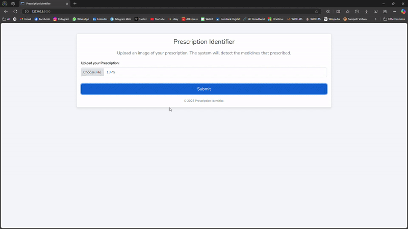
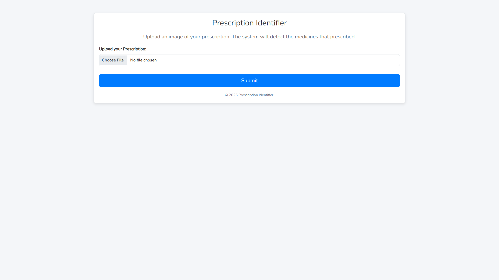
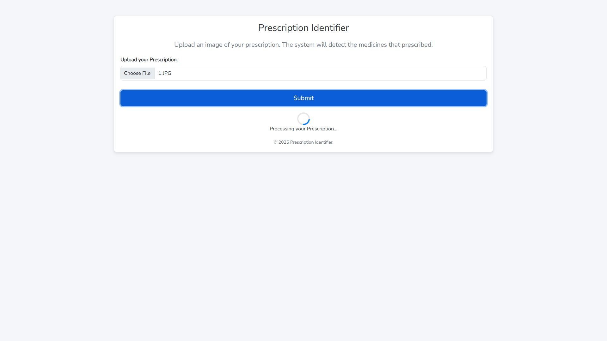
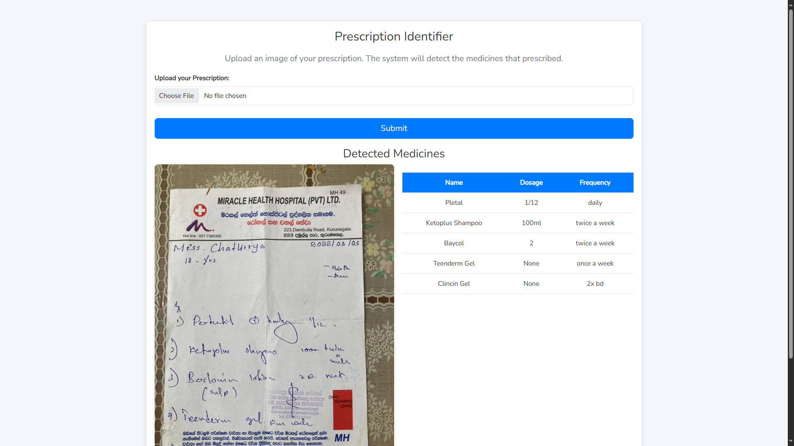

# AI Prescription Reader: User Manual



## Introduction

Welcome to the AI Prescription Reader application. This manual will guide you through the steps to install and use the application effectively.

## Requirements

- Python 3.12.6
- Other requirements are mentioned in `requirements.txt`

## Installation

### 1. Clone the GitHub Repository

```sh
git clone https://github.com/your-repo/ai_prescription_reader.git
```

### 2. Setup

#### Method 1: Using `setup.py`

1. Open a terminal and navigate to the folder.
2. Run the following command to set up the project for the first time:

   ```sh
   python setup.py
   ```

#### Method 2: Manual Setup

1. Open a terminal and navigate to the folder.

2. **Create a Virtual Environment**:

   ```sh
   python -m venv .myenv
   ```

3. **Activate the Virtual Environment**:

   ```sh
   .myenv\Scripts\activate
   ```

4. **Install the Required Packages**:

   ```sh
   pip install -r requirements.txt
   ```

5. **Run the Application**:

   ```sh
   python app.py
   ```

## Running the Application

1. Open a terminal and navigate to the folder.

2. **Activate the Virtual Environment**:

   ```sh
   .myenv\Scripts\activate
   ```

3. **Run the Application**:

   ```sh
   python app.py
   ```

## Usage

Access the application in your browser at: [http://127.0.0.1:5000/](http://127.0.0.1:5000/)

## Getting Started

1. **Launch the Application**: by any method previously mentioned.

2. **Upload Prescription Image**: Click on the "Upload" button to select and upload an image of the prescription. You can find sample images in the `sample_images` folder.

   

3. **Process Image**: Once the image is uploaded, click on the "Submit" button to start the analysis.

   

4. **View Results**: After processing, the application will display the extracted information from the prescription.

   

## Features

- **Medicine Name Extraction**: Extracts the medicine name from the given prescription image.
- **Medicine Dosage Extraction**: Extracts the medicine dosage from the given prescription image.
- **Medicine Frequency Extraction**: Extracts the medicine frequency from the given prescription image.

## Troubleshooting

- **Image Not Uploading**: Ensure the image file is in a supported format (JPEG, PNG) and less than 16 MB in size.
- **Incorrect Extraction**: Verify the quality of the uploaded image. Blurry or unclear images may result in incorrect extraction.
